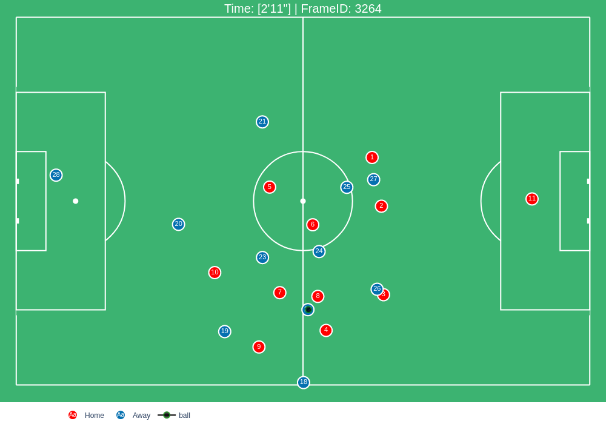
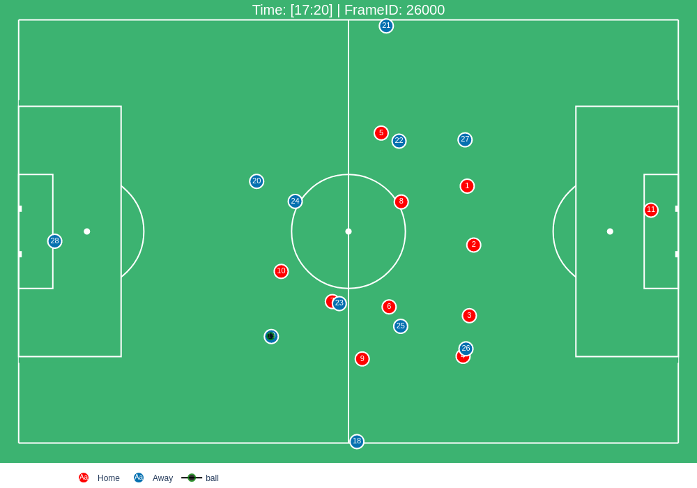
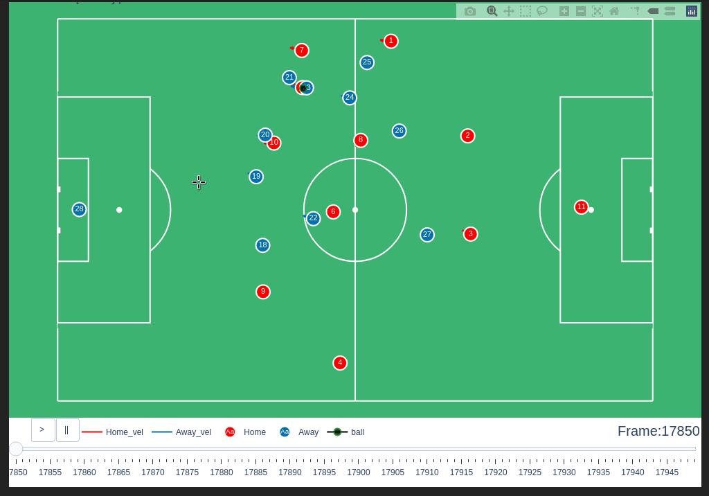
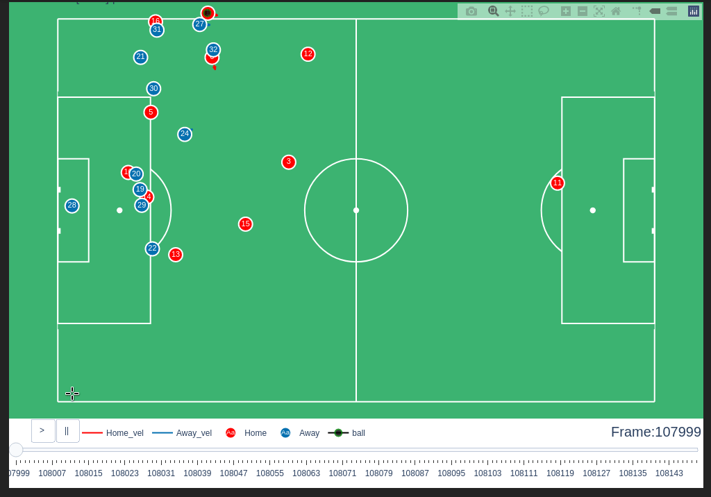

=====
Usage
=====

To use pitchly in a project::

	import pitchly

As of now , `pitchly` works only with Metrica Sports data format (old and new EPTS FIFA)

Data Loading
============

`kloppy` and `codeball` are used to load the tracking and event data from Metrica. Click `here <https://github.com/metrica-sports/sample-data>`_ for the sample open data

.. code-block:: python
    :linenos:

    # match directory
    match_dir = "/home/opunsoars/xFootball/datahub/"

    # tracking data [METRICA]
    from codeball import GameDataset

    metadata_file = (glob.glob(f"{match_dir}/*metadata*")[0]) #xml file
    tracking_file = (glob.glob(f"{match_dir}/*tracking*")[0]) #txt file

    dataset = GameDataset(
        tracking_metadata_file=metadata_file,
        tracking_data_file=tracking_file
    )

    # event data [METRICA]
    from kloppy.helpers import load_metrica_json_event_data

    dataset = load_metrica_json_event_data(raw_data_filename=glob.glob(f"{match_dir}/*json")[0],
                                                metadata_filename=glob.glob(f"{match_dir}/*metadata*")[0], 
                                                options=None) 

Tracking Data
=============

.. code-block:: python
    :linenos:

    # import the pitchly wrapper for metrica tracking data
    from pitchly.metrica import TrackingData

    # feed the loaded data 
    data = TrackingData(dataset.tracking,dataset.metadata)

Plot Frame by FrameID
^^^^^^^^^^^^^^^^^^^^^
.. code-block:: python

    data.plot_frame(frameID=264)

Plot Frame by Time
^^^^^^^^^^^^^^^^^^^^^
.. code-block:: python

    data.plot_frame(time='17:20')

Plot Sequence by FrameIDs
^^^^^^^^^^^^^^^^^^^^^^^^^
You can plot a sequence of frames with a slider to animate/track an event.

.. code-block:: python

    data.plot_sequence(f0=17850,f1=17950)

Plot Sequence by Time
^^^^^^^^^^^^^^^^^^^^^
Or use the start time and end time for an interval sequence.

.. code-block:: python

    data.plot_sequence(t0='72',t1='72:06')

