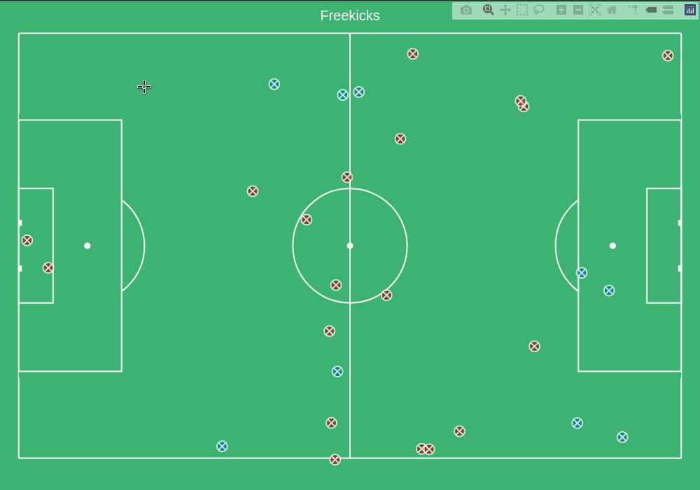
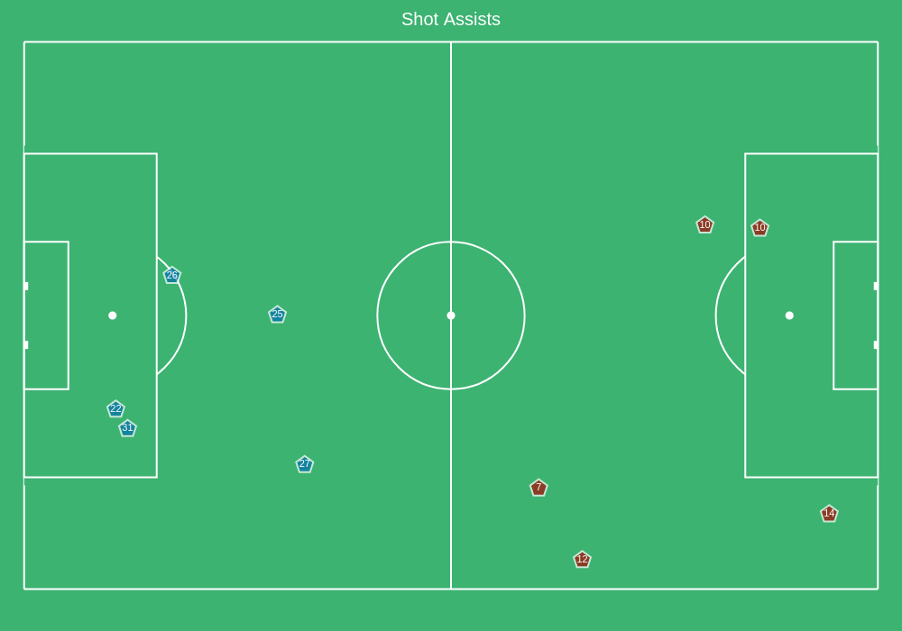
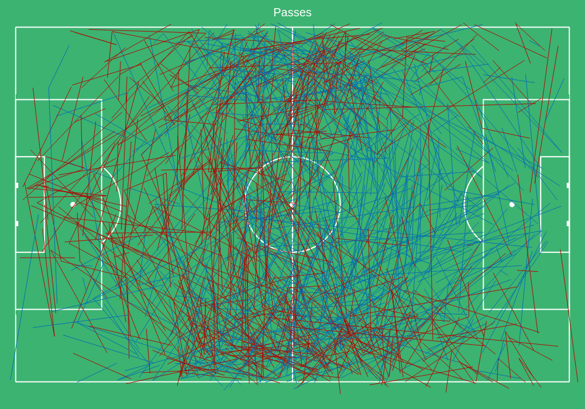

=====
Usage
=====

To use pitchly in a project::

	import pitchly

As of now , ``pitchly`` works only with Metrica Sports data format (old and new EPTS FIFA).
So the recommended starting point for now is ``from pitchly.metrica import ...``

Data Loading
============

``kloppy`` is used to load the tracking and event data from Metrica. Click `here <https://github.com/metrica-sports/sample-data>`_ for the sample open data

.. code-block:: python
    :linenos:

    import glob
    import kloppy

    # match directory
    match_dir = "/match/folder/with/metrica/data/"

    # tracking data [METRICA]
    metadata_file = glob.glob(f"{match_dir}/*metadata*")[0]  # xml file
    tracking_file = glob.glob(f"{match_dir}/*tracking*")[0]  # txt file

    dataset = kloppy.load_epts_tracking_data(raw_data_filename=tracking_file, metadata_filename=metadata_file, options=None)

    metadata = dataset.metadata
    tracking_dataset = kloppy.to_pandas(dataset)

    # event data [METRICA]
    events_file = glob.glob(f"{match_dir}/*events*")[0]  # txt file

    event_dataset = kloppy.load_metrica_json_event_data(
        raw_data_filename=events_file, metadata_filename=metadata_file, options=None
    )

Basic Football Pitch
====================

``pitchly`` can be used to plot a basic football pitch (currently Metrica data dimensions) and building further on it as needed.

.. code-block:: python
    :linenos:

    from pitchly.pitch import Pitch

    pitch = Pitch()
    fig = pitch.plot_pitch()

This is however not needed for any further plots as demonstrated below.

Tracking Data
=============

.. code-block:: python
    :linenos:

    # import the pitchly wrapper for metrica tracking data
    from pitchly.metrica import TrackingData

    # feed the loaded data 
    data = TrackingData(tracking_dataset,metadata)

Plot Frame by FrameID
^^^^^^^^^^^^^^^^^^^^^
.. code-block:: python

    data.plot_frame(frameID=3264)

Plot Frame by Time
^^^^^^^^^^^^^^^^^^^^^
.. code-block:: python

    data.plot_frame(time='17:20')

.. image:: imgs/t2.png
    :width: 500
    :alt: Output of plot_frame by time

Plot Sequence by FrameIDs
^^^^^^^^^^^^^^^^^^^^^^^^^
You can plot a sequence of frames with a slider to animate/track an event.

.. code-block:: python

    data.plot_sequence(f0=15850,f1=15950)

Plot Sequence by Time
^^^^^^^^^^^^^^^^^^^^^
Or use the start time and end time for an interval sequence.

.. code-block:: python

    data.plot_sequence(t0='72',t1='72:06')

.. image:: imgs/t2.gif
    :width: 500
    :alt: Output of plot_sequence by time

Pitch Control
^^^^^^^^^^^^^
The pitch control is calculated by adapting `Laurie Shaw's <https://twitter.com/eightyfivepoint>`_ work on `William Spearman's model <https://www.researchgate.net/publication/334849056_Quantifying_Pitch_Control>`_.
Since generating pitch control visualization on the fly gets sluggish, it is recommended to
proceed with slight patience using the sliders (the pitch control overlay reloads with a tiny
delay for every frame). The example shown here is for a very small time range (5 seconds / 125
frames) and generating the viz takes 7 minutes.

.. code-block:: python

    data.plot_sequence(t0='72',t1='72:05', pitch_control = True)

Generating pitch control overlay for individual frame/time inputs is fairly faster.

.. code-block:: python

    data.plot_frame(time='17:20', pitch_control = True)

Event Data
==========

.. code-block:: python
    :linenos:

    # import the pitchly wrapper for metrica event data
    from pitchly.metrica import EventData

    # feed the loaded data 
    data = EventData(event_dataset.events)

You can now plot various events cumulatively from the match by calling for ``type``

Shots
^^^^^

.. code-block:: python

    data.plot(type="shots")

You can set ``trace=True`` to see the trace of the shots

Goals
^^^^^

.. code-block:: python

    data.plot(type="goals")

.. image:: imgs/goals.gif
    :width: 500
    :alt: goals

You can set ``trace=True`` to see the trace of the goals

Corners
^^^^^^^

.. code-block:: python

    data.plot(type="corners")

.. image:: imgs/corners.png
    :width: 500
    :alt: corners

Freekicks
^^^^^^^^^

.. code-block:: python

    data.plot(type="freekicks")

You can set ``trace=True`` to see the trace of the freekicks

Challenges
^^^^^^^^^^

.. code-block:: python

    data.plot(type="challenges")

Challenges do not have ``trace`` option

Recoveries
^^^^^^^^^^

.. code-block:: python

    data.plot(type="recoveries")

.. image:: imgs/recoveries.gif
    :width: 500
    :alt: recoveries

Recoveries do not have ``trace`` option

Shot Assists
^^^^^^^^^^^^

.. code-block:: python

    data.plot(type="shot_assists")

You can set ``trace=True`` to see the trace of the shot assists

Assists
^^^^^^^

.. code-block:: python

    data.plot(type="assists")

.. image:: imgs/assists.png
    :width: 500
    :alt: assists

You can set ``trace=True`` to see the trace of the assists

Passes
^^^^^^

.. code-block:: python

    data.plot(type="passes")

Passers
^^^^^^^

.. code-block:: python

    data.plot(type="passers")

Receivers
^^^^^^^^^

.. code-block:: python

    data.plot(type="receivers")

Plot Event by Index
^^^^^^^^^^^^^^^^^^^

You can plot a specific event with its chain as follows:

.. code-block:: python

    data.plot(index=3478)

.. image:: imgs/sample_chain.png
    :width: 500
    :alt: event chain

In order to know the index, you can browse the subset of choice using a ``kloppy`` helper:

.. code-block:: python

    kloppy.to_pandas(data.get_shots(),
                     additional_columns={'index_to_plot': lambda row: row.raw_event['index']}).set_index('index_to_plot')

Old Metrica Format (csv)
========================

The older samples of Metrica data follow the ``.csv`` format and they can be loaded and used with ``pitchly`` in the following way:

.. code-block:: python
    :linenos:

    import glob
    from pitchly.utils import load_data
    from pitchly.metrica_old import TrackingData,EventData

    # match directory
    match_dir = "/match/folder/with/metrica/data/"

    # load the data 
    tracking_home, tracking_away, events = load_data(match_dir)

    # tracking
    data = TrackingData(tracking_home, tracking_away)
    data.plot_sequence(...)

    # events
    data = data = EventData(events)
    data.plot(type="shots", trace=True)