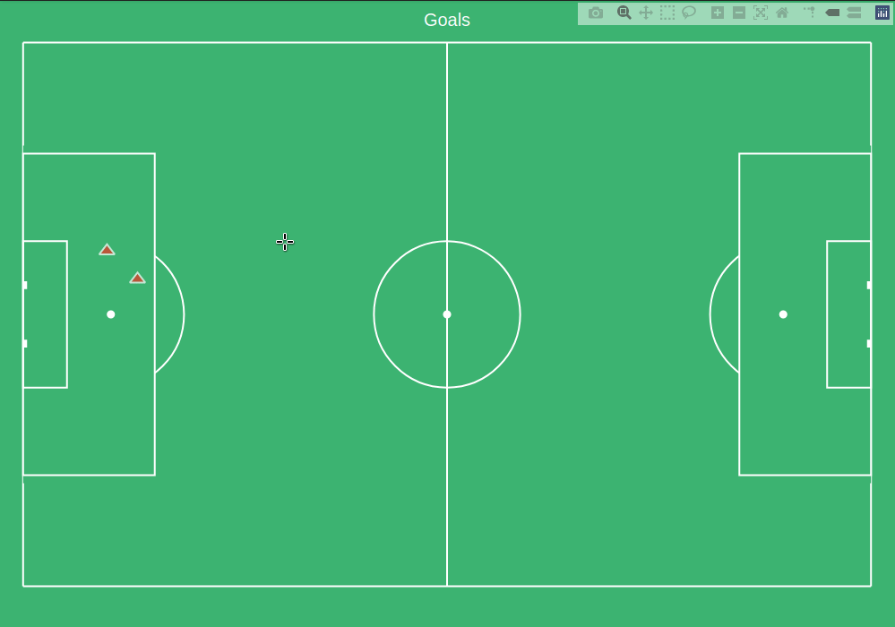
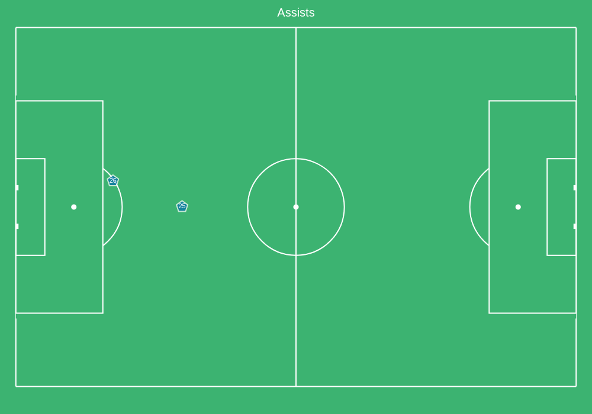

=====
Usage
=====

To use pitchly in a project::

	import pitchly

As of now , ``pitchly`` works only with Metrica Sports data format (old and new EPTS FIFA).
So the recommended starting point for now is ``from pitchly.metrica import ...``

Data Loading
============

``kloppy`` and ``codeball`` are used to load the tracking and event data from Metrica. Click `here <https://github.com/metrica-sports/sample-data>`_ for the sample open data

.. code-block:: python
    :linenos:

    # match directory
    match_dir = "/home/opunsoars/xFootball/datahub/"

    # tracking data [METRICA]
    from codeball import GameDataset

    metadata_file = (glob.glob(f"{match_dir}/*metadata*")[0]) #xml file
    tracking_file = (glob.glob(f"{match_dir}/*tracking*")[0]) #txt file

    tracking_dataset = GameDataset(
        tracking_metadata_file=metadata_file,
        tracking_data_file=tracking_file
    )

    # event data [METRICA]
    from kloppy.helpers import load_metrica_json_event_data

    event_dataset = load_metrica_json_event_data(raw_data_filename=glob.glob(f"{match_dir}/*json")[0],
                                                metadata_filename=glob.glob(f"{match_dir}/*metadata*")[0], 
                                                options=None) 

Tracking Data
=============

.. code-block:: python
    :linenos:

    # import the pitchly wrapper for metrica tracking data
    from pitchly.metrica import TrackingData

    # feed the loaded data 
    data = TrackingData(tracking_dataset.tracking,tracking_dataset.metadata)

Plot Frame by FrameID
^^^^^^^^^^^^^^^^^^^^^
.. code-block:: python

    data.plot_frame(frameID=264)

.. image:: imgs/t1.png
    :width: 500
    :alt: Output of plot_frame by frameID

Plot Frame by Time
^^^^^^^^^^^^^^^^^^^^^
.. code-block:: python

    data.plot_frame(time='17:20')

Plot Sequence by FrameIDs
^^^^^^^^^^^^^^^^^^^^^^^^^
You can plot a sequence of frames with a slider to animate/track an event.

.. code-block:: python

    data.plot_sequence(f0=17850,f1=17950)

.. image:: imgs/t1.gif
    :width: 500
    :alt: Output of plot_sequence by frameID

Plot Sequence by Time
^^^^^^^^^^^^^^^^^^^^^
Or use the start time and end time for an interval sequence.

.. code-block:: python

    data.plot_sequence(t0='72',t1='72:06')

Event Data
==========

.. code-block:: python
    :linenos:

    # import the pitchly wrapper for metrica event data
    from pitchly.metrica import EventData

    # feed the loaded data 
    data = EventData(event_dataset)

You can now plot various events cumulatively from the match by calling for ``type``

Shots
^^^^^

.. code-block:: python

    data.plot(type="shots")

.. image:: imgs/shots.gif
    :width: 500
    :alt: shots

You can set ``trace=True`` to see the trace of the shots

Goals
^^^^^

.. code-block:: python

    data.plot(type="goals")

You can set ``trace=True`` to see the trace of the goals

Corners
^^^^^^^

.. code-block:: python

    data.plot(type="corners")

Freekicks
^^^^^^^^^

.. code-block:: python

    data.plot(type="freekicks")

.. image:: imgs/freekicks.gif
    :width: 500
    :alt: freekicks

You can set ``trace=True`` to see the trace of the freekicks

Challenges
^^^^^^^^^^

.. code-block:: python

    data.plot(type="challenges")

.. image:: imgs/challenges.gif
    :width: 500
    :alt: challenges

Challenges do not have ``trace`` option

Recoveries
^^^^^^^^^^

.. code-block:: python

    data.plot(type="recoveries")

Recoveries do not have ``trace`` option

Shot Assists
^^^^^^^^^^^^

.. code-block:: python

    data.plot(type="shot_assists")

.. image:: imgs/shot_assists.png
    :width: 500
    :alt: shot assists

You can set ``trace=True`` to see the trace of the shot assists

Assists
^^^^^^^

.. code-block:: python

    data.plot(type="assists")

You can set ``trace=True`` to see the trace of the assists

Passes
^^^^^^

.. code-block:: python

    data.plot(type="passes")

.. image:: imgs/passes.png
    :width: 500
    :alt: passes

Passers
^^^^^^^

.. code-block:: python

    data.plot(type="passers")

.. image:: imgs/passers.png
    :width: 500
    :alt: passers

Receivers
^^^^^^^^^

.. code-block:: python

    data.plot(type="receivers")

.. image:: imgs/receivers.png
    :width: 500
    :alt: receivers

Plot Event by Index
^^^^^^^^^^^^^^^^^^^

You can plot a specific event with its chain as follows:

.. code-block:: python

    data.plot(index=3478)

In order to know the index, you can browse the subset of choice using a ``kloppy`` helper:

.. code-block:: python

    kloppy.to_pandas(data.get_shots(),additional_columns={'index_to_plot':lambda row: row.raw_event['index']})